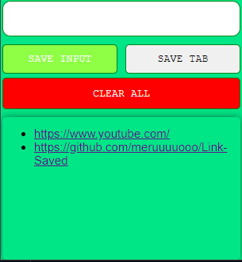

# Link Tracker Extension

The Link Tracker extension is a tool that allows users to save links and track them conveniently. It is designed to work with the browser's local storage to store the links securely on the user's device.

## Features

- Save Links: The extension provides a simple interface to save links. Users can easily add links to their collection with just a few clicks.

- Current Window URL Grabber: The extension automatically grabs the URL of the current window, making it easy for users to save the link they are currently browsing.

- Local Storage: All saved links are stored securely in the browser's local storage. This ensures that the links are accessible only to the user and are not uploaded to any external servers.

## Installation

To use the Link Tracker extension, follow these steps:

1. Download the extension files to your local machine.
2. Open your browser's extension settings.
3. Enable developer mode.
4. Click on "Load unpacked" and select the downloaded extension files.
5. The Link Tracker extension should now be installed and ready to use.

## Usage

Once the Link Tracker extension is installed, you can start using it immediately. Here's how:

1. Click on the extension icon in your browser's toolbar.
2. A popup window will appear, allowing you to save the current URL or enter a custom link.
3. Click on the "Save" button to save the link to your local storage.

## Limitations

Please be aware of the following limitations of the Link Tracker extension:

- The extension only saves links to the local storage of your browser. If you clear your browser's cache or switch to a different device, the saved links will not be accessible.
- The extension does not provide any syncing or backup functionality. It is recommended to regularly export your saved links to a separate file or service to prevent data loss.

## Note

Please note that this extension has not been uploaded to the web store. It is a project that originated from a Scrimba course, and it is intended for educational purposes or personal use.

